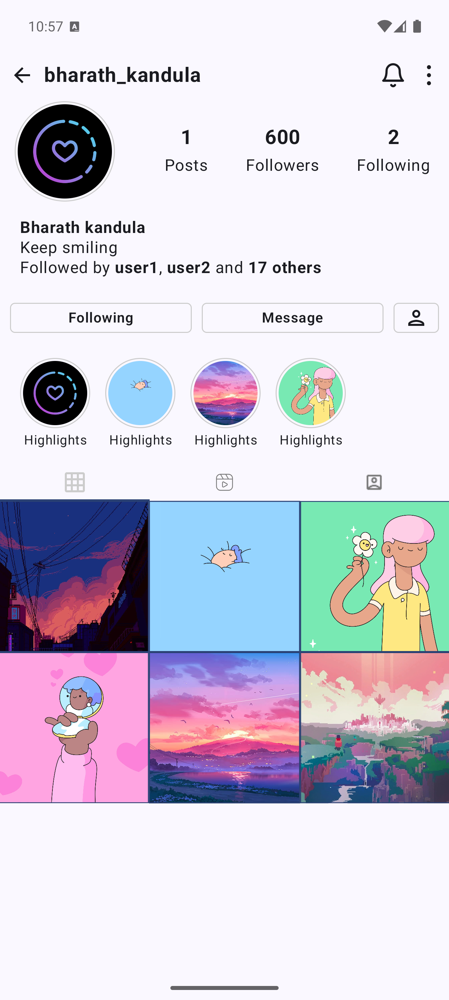

# Insta-Profile screen Jetpack

An Android application showcasing an Instagram-like profile screen, built using Jetpack Compose.

## Features

* Key features here:
    * Display user profile information (name, bio, profile picture)
    * Show a grid of user posts
    * Modern UI built with Jetpack Compose

## APK file

[Click here to download APK file](readmeResources/)

## Screenshots

## Technologies Used

* [Kotlin](https://kotlinlang.org/)
* [Jetpack Compose](https://developer.android.com/jetpack/compose)

## Setup/Installation

1. Clone the repository: `git clone https://github.com/bharathkandula99/insta-profile-jetpack.git`
2. Open the project in Android Studio.
3. Build and run the application on an Android device or emulator.

## How to Contribute

If you'd like to contribute, please follow these steps:

1. Fork the repository.
2. Create a new branch (`git checkout -b feature/your-feature-name`).
3. Make your changes.
4. Commit your changes (`git commit -m 'Add some feature'`).
5. Push to the branch
6. Open a Pull Request.

